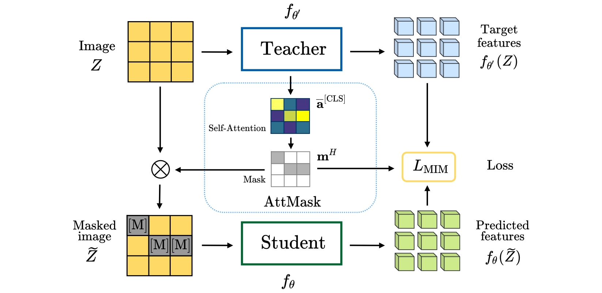

# What to Hide from Your Students: Attention-Guided Masked Image Modeling

[ECCV 2022] PyTorch implementation and pretrained models for AttMask. 
[[`paper`](https://www.ecva.net/papers/eccv_2022/papers_ECCV/papers/136900299.pdf)][[`arXiv`](https://arxiv.org/abs/2203.12719)][[`DOI`](https://doi.org/10.1007/978-3-031-20056-4_18)]

<div align="center">
  
</div>

## Pretrained models
You can download only the weights of the pretrained backbone used for downstream tasks, or the full checkpoint which contains backbone and projection head weights for both student and teacher networks. We also provide arguments and training logs. All backbones are `ViT-S/16` models.


<table>
  <tr>
    <th>Percentage of ImageNet Train Set</th>
    <th>Epochs</th>
    <th>AttMask Mode</th>
    <th>k-NN</th>
    <th>Linear Probing</th>
    <th colspan="5">download</th>
  </tr>
  <tr>
    <td>100%</td>
    <td>100</td>
    <td>Hints</td>
    <td>72.8</td>
    <td>76.1 </td>
    <td><a href="https://drive.google.com/file/d/1HLMTLnEYZDrNN_8HHQRksUJaqrjsaI0m/view?usp=sharing">backbone only</a></td>
    <td><a href="https://drive.google.com/file/d/1B3DmF7QSP8pb3qS1XEnNaKQLdOKNLwnq/view?usp=sharing">full ckpt</a></td>
    <td><a href="https://drive.google.com/file/d/19MlU8L0qQ5WmZjtGjiq3In_K36NHZ9pN/view?usp=sharing">logs</a></td>
  </tr>
  <tr>
    <td>100%</td>
    <td>100</td>
    <td>High</td>
    <td>72.5</td>
    <td>75.7</td>
    <td><a href="https://drive.google.com/file/d/1VyxlsxqW7lCxuDoBA-hg28bel4uSEect/view?usp=sharing">backbone only</a></td>
    <td><a href="https://drive.google.com/file/d/1bm1aZzoPM9FH_ReL1839sewLr1TO6SDv/view?usp=sharing">full ckpt</a></td>
    <td><a href="https://drive.google.com/file/d/1MOHeBcP7znieqFbTjyX5yzTy8AMvhHMH/view?usp=sharing">logs</a></td>
  </tr>
  <tr>
    <td>100%</td>
    <td>300</td>
    <td>High</td>
    <td>75.0</td>
    <td>77.5</td>
    <td><a href="https://drive.google.com/file/d/10Mu3W7_DZemhefYFoBmz_IKNbtMIjqMI/view?usp=sharing">backbone only</a></td>
    <td><a href="https://drive.google.com/file/d/1lHMULggPnnEWwAzSPgaBEfay6rNF8OcH/view?usp=sharing">full ckpt</a></td>
    <td><a href="https://drive.google.com/file/d/1q3mrijDj1w--NXjLeMBt94gVjPrv9l-P/view?usp=sharing">logs</a></td>
   </tr>
   <tr>
    <td>20%</td>
    <td>100</td>
    <td>Hints</td>
    <td>49.5</td>
    <td>57.5</td>
    <td><a href="https://drive.google.com/file/d/1H77eMcGv7lbp53VpNAs2qbh-jCtgSZ2g/view?usp=sharing">backbone only</a></td>
    <td><a href="https://drive.google.com/file/d/1-mxjXPgBMjgWHKicx_pmXklEaM_YEMn2/view?usp=sharing">full ckpt</a></td>
    <td><a href="https://drive.google.com/file/d/1QVtJFZ0arKVgRr5yhtlrOKvPha5oRut2/view?usp=sharing">logs</a></td>
  </tr>
  <tr>
    <td>20%</td>
    <td>100</td>
    <td>High</td>
    <td>49.7</td>
    <td>57.9</td>
    <td><a href="https://drive.google.com/file/d/1TvBwMFOXoqSXeNmW8XNGC4qqdQ5iPvwT/view?usp=sharing">backbone only</a></td>
    <td><a href="https://drive.google.com/file/d/1bQFqXGJLgHy4ZoUqP7SvpdjcXrZERQit/view?usp=sharing">full ckpt</a></td>
    <td><a href="https://drive.google.com/file/d/1Q2_m_ajxbUQIWObaPNF_FAagO5CvdKW8/view?usp=sharing">logs</a></td>
  </tr>
</table>

## Training

### Installation
Please install [PyTorch](https://pytorch.org/) and download the [ImageNet](https://imagenet.stanford.edu/) dataset. The experiments have been performed with python version 3.7.6, PyTorch version 1.7.0, CUDA 10.1 and torchvision 0.8.1.

The requirements are easily installed via
[Anaconda](https://www.anaconda.com/distribution/#download-section):

```bash 
conda create -n attmask python=3.7.6
conda activate attmask
conda install pytorch==1.7.0 torchvision==0.8.1 cudatoolkit=10.1 pillow==8.0.1 -c pytorch
pip install timm==0.4.12 tensorboardx==2.5.1 scikit-learn==0.23.2 munkres==1.1.4 tqdm
```

---

### AttMask training
Pre-train AttMask on ImageNet-1k. Modify `--nproc_per_node` and `--batch_size_per_gpu` based on you available GPUs.

#### Full ImageNet-1k pre-training

Train **AttMask-Hint** with a ViT-small network for **100 epochs** on the full ImageNet-1k:

```bash   
python -m torch.distributed.launch --nproc_per_node=4 main_attmask.py --batch_size_per_gpu 60 \
--norm_last_layer False --momentum_teacher 0.996 --num_workers 4 --eval_every 20 \
--arch vit_small --teacher_temp 0.07 --warmup_teacher_temp_epochs 30 --epochs 100 \
--shared_head True --out_dim 8192 --local_crops_number 10 --global_crops_scale 0.25 1 \
--local_crops_scale 0.05 0.25 --pred_ratio 0.3 --pred_ratio_var 0.2 --masking_prob 0.5 \
--pred_shape attmask_hint --show_max 0.1 \
--subset -1 --data_path /path/to/ImageNet --output_dir /path/to/output/
```

Train **AttMask-High** with a ViT-small network for **100 epochs** on the full ImageNet-1k:

```bash   
python -m torch.distributed.launch --nproc_per_node=4 main_attmask.py --batch_size_per_gpu 60 \
--norm_last_layer False --momentum_teacher 0.996 --num_workers 4 --eval_every 20 \
--arch vit_small --teacher_temp 0.07 --warmup_teacher_temp_epochs 30 --epochs 100 \
--shared_head True --out_dim 8192 --local_crops_number 10 --global_crops_scale 0.25 1 \
--local_crops_scale 0.05 0.25 --pred_ratio 0.3 --pred_ratio_var 0.2 --masking_prob 0.5 \
--pred_shape attmask_high \
--subset -1 --data_path /path/to/ImageNet --output_dir /path/to/output/
```

Train **AttMask-High** with a ViT-small network for **300 epochs** on the full ImageNet-1k:

```bash   
python -m torch.distributed.launch --nproc_per_node=8 main_attmask.py --batch_size_per_gpu 100 \
--norm_last_layer False --momentum_teacher 0.996 --num_workers 4 --eval_every 20 \
--arch vit_small --teacher_temp 0.07 --warmup_teacher_temp_epochs 30 --epochs 300 \
--shared_head True --out_dim 8192 --local_crops_number 10 --global_crops_scale 0.32 1 \
--local_crops_scale 0.05 0.32 --pred_ratio 0.3 --pred_ratio_var 0.2 --masking_prob 0.5 \
--pred_shape attmask_high \
--subset -1 --data_path /path/to/ImageNet --output_dir /path/to/output/
```

#### 20% of ImageNet-1k pre-training

Train **AttMask-Hint** with a ViT-small network for **100 epochs** on the 20% of the ImageNet-1k:

```bash 
python3 -m torch.distributed.launch --nproc_per_node=4 main_attmask.py --batch_size_per_gpu 60 \
--norm_last_layer False --momentum_teacher 0.99 --num_workers 4 --eval_every 20 \
--arch vit_small --teacher_temp 0.07 --warmup_teacher_temp_epochs 30 --epochs 100 \
--shared_head True --out_dim 8192 --local_crops_number 6 --global_crops_scale 0.25 1 \
--local_crops_scale 0.05 0.25 --pred_ratio 0.3 --pred_ratio_var 0.2 --masking_prob 0.5 \
--pred_shape attmask_hint --show_max 0.1 \
--subset 260 --data_path /path/to/ImageNet --output_dir /path/to/output/
```

> For the **AttMask-High** or **AttMask-Low**, just remove the argument `--show_max 0.1` and modify `--pred_shape attmask_high` or `--pred_shape attmask_low`.

---

## Evaluation

### k-NN evaluation

K-NN ImageNet evaluation on full ImageNet-1k or on 20% of the training examples (set `--subset 260`). Modify `--nproc_per_node` based on you available GPUs.

```bash
python3 -m torch.distributed.launch --nproc_per_node=1 evaluation/eval_knn.py \
--arch vit_small --checkpoint_key teacher --avgpool_patchtokens 0 \
--pretrained_weights /path/to/checkpoint.pth --data_path /path/to/ImageNet --subset -1
```

### Linear probing evaluation

Linear probing ImageNet evaluation on full ImageNet-1k or on 20% of the training examples (set `--subset 260`). Modify `--nproc_per_node` and `--batch_size_per_gpu` based on you available GPUs.

```bash 
python3 -m torch.distributed.launch --nproc_per_node=2 evaluation/eval_linear.py \
--batch_size_per_gpu 1024 --n_last_blocks 4 --avgpool_patchtokens 0 --arch vit_small --lr 0.005 \
--pretrained_weights /path/to/checkpoint.pth --data_path /path/to/ImageNet --output_dir /path/to/output/ --subset -1
```

### Low shot evaluation

Low shot ImageNet evaluation task, where only `ν = 1, 5, 10 or 20` examples per class of the training set are used for the k-NN classifier.

For `ν = 1` use `--nb_knn 1 --subset 1` and average the results of 5 different runs using different subset `--subset_starts 0` , `5`, `10`, `15` and `20`

For `ν = 5` use `--nb_knn 20 --subset 5` and average the results of 5 different runs using different subset `--subset_starts 0` , `5`, `10`, `15` and `20`

For `ν = 10` use `--nb_knn 20 --subset 10` and average the results of 5 different runs using different subset `--subset_starts 0` , `10`, `20`, `30` and `40`

For `ν = 20` use `--nb_knn 20 --subset 20` and average the results of 5 different runs using different subset `--subset_starts 0` , `20`, `40`, `60` and `80`


Example for the first run using `ν = 1`:

```bash 
python3 -m torch.distributed.launch --nproc_per_node=1 evaluation/eval_knn_few.py \
--checkpoint_key teacher --avgpool_patchtokens 0 --arch vit_small \
--pretrained_weights /path/to/checkpoint --data_path /path/to/ImageNet \
--nb_knn 1 --subset 1 --subset_starts 0
```

### Masked ImageNet1k evaluation

Linear probing top-1 accuracy on a more challenging masked version of ImageNet1k validation set. Modify `--nproc_per_node` based on you available GPUs.

Example for `0.7` masking ratio:

```bash 
python -m torch.distributed.launch --nproc_per_node=1 evaluation/eval_linear_acc_drop.py \
--num_workers 4 --output_dir /path/to/output --data_path /path/to/ImageNet \
--pretrained_weights /path/to/checkpoint --n_last_blocks 4 --avgpool_patchtokens 0 \
--arch vit_small --subset -1 --batch_size_per_gpu 30 --lr 0.001 --load_from checkpoint_teacher_linear.pth \
--masking_ratio 0.7
```

### Background robustness on ImageNet-9

Combine the pre-trained models and the linear head from the linear probing:

```bash 
python models/combine_ckpt.py \
  --checkpoint_pretraining /path/to/pretrained/checkpoint \
  --checkpoint_linear /path/to/linear_probing_head \
  --output_file /path/to/combined_checkpoint
```

Perform the background robustness evaluation:

Download and unzip the [datasets](https://github.com/MadryLab/backgrounds_challenge/releases) and run the following:

```bash 
python3 evaluation/backgrounds_challenge/in9_eval.py \
--arch vit_small \
--checkpoint /path/to/combined_checkpoint \
--data-path /path/to/dataset/bg_challenge 
```

### Finetuning evaluation on other image classification datasets

For finetuning on CIFAR10 run:

```bash 
python3 -m torch.distributed.launch --nproc_per_node=6 evaluation/eval_transfer_finetuning.py \
--avgpool_patchtokens 0 \
--arch vit_small \
--checkpoint_key teacher \
--batch-size 150 \
--lr 7.5e-6 \
--epochs 500 \
--pretrained_weights /path/to/pretrained/checkpoint \
--output_dir /path/to/output \
--data_set CIFAR10 \
--data_path data/cifar
```

> For finetuning on CIFAR100 modify the `--data_set CIFAR100` and on Oxford Flowers modify the `--data_set Flowers` and the `--epochs 1000`.


### Common Errors
If you face NCCL errors during the evaluations, try to use `--backend gloo`.

## Acknowledgement

This repository is built using the [iBOT](https://github.com/bytedance/ibot), [DINO](https://github.com/facebookresearch/dino), [BEiT](https://github.com/microsoft/unilm/tree/master/beit) and [ImageNet-9](https://github.com/MadryLab/backgrounds_challenge) repositories.

NTUA thanks NVIDIA for the support with the donation of GPU hardware.

## License
This repository is released under the Apache 2.0 license as found in the [LICENSE](LICENSE) file.

## Citation
If you find this repository useful, please consider giving a star :star: and citation:
```bibtex
@InProceedings{kakogeorgiou2022attmask,
author={Kakogeorgiou, Ioannis and Gidaris, Spyros and Psomas, Bill and Avrithis, Yannis and Bursuc, Andrei and Karantzalos, Konstantinos and Komodakis, Nikos},
title={What to Hide from Your Students: Attention-Guided Masked Image Modeling},
booktitle={Computer Vision -- ECCV 2022},
year={2022},
publisher={Springer Nature Switzerland},
pages={300-318},
isbn={978-3-031-20056-4},
url={https://link.springer.com/chapter/10.1007/978-3-031-20056-4_18},
DOI={10.1007/978-3-031-20056-4_18}
}
```
